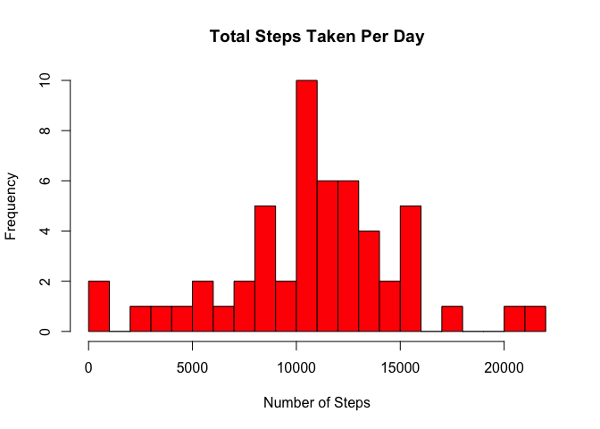
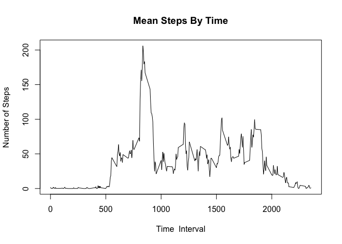
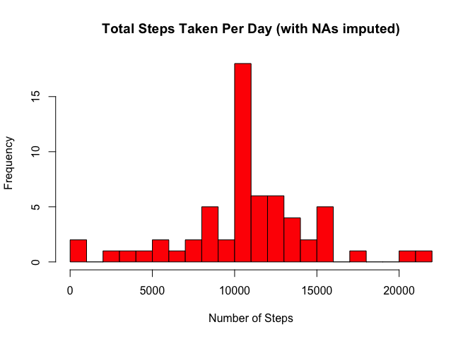
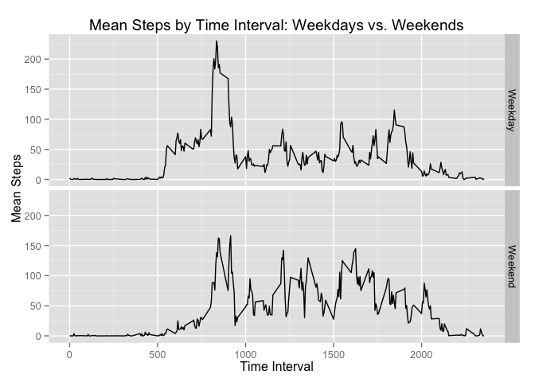

# Reproducible Research: Peer Assessment 1
Before we begin, we will load the necessary packages for later steps.

```r
library(dplyr)
```

```
## 
## Attaching package: 'dplyr'
## 
## The following object is masked from 'package:stats':
## 
##     filter
## 
## The following objects are masked from 'package:base':
## 
##     intersect, setdiff, setequal, union
```

```r
library(ggplot2)
```
## Loading and preprocessing the data
First, we will unzip and load the data.

```r
unzip("activity.zip")
data <- read.csv("activity.csv")
```

We will also ensure that values in the date column are interpreted by R as dates.

```r
data$date <- as.Date(data$date)
```

## What is mean total number of steps taken per day?
We will calcluate the total number of steps per day, and plot the results as a histogram.

```r
totalsteps <- aggregate(data[,"steps"], list(data$date), sum)
hist(totalsteps$x, breaks=20, col="red", main="Total Steps Taken Per Day", xlab="Number of Steps")
```

 

The mean and median number of steps per day are as follows:

```r
mean(totalsteps$x, na.rm=TRUE)
```

```
## [1] 10766.19
```

```r
median(totalsteps$x, na.rm=TRUE)
```

```
## [1] 10765
```

## What is the average daily activity pattern?
We will calculate the mean number of steps taken per five-minute time interval, and plot the results as a time series.

```r
meanbytime <- aggregate(data[,"steps"], list(data$interval), mean, na.rm=TRUE)
plot(meanbytime$Group.1, meanbytime$x, type="l", xlab="Time  Interval", ylab="Number of Steps", 
     main="Mean Steps By Time")
```

 

The time interval with the largest mean number of steps is as follows:

```r
meanbytime[which.max(meanbytime[,"x"]),"Group.1"]
```

```
## [1] 835
```

## Imputing missing values
The number of rows containing missing values is as follows:

```r
sum(is.na(data$steps))
```

```
## [1] 2304
```

To fill in the missing values, we will use the mean number of steps for each missing value's corresponding time interval.

```r
imputed <- data
steprows <- which(is.na(data$steps))
natimes <- data$interval[steprows]
imputed$steps[steprows] <- meanbytime$x[match(imputed$interval[steprows], meanbytime$Group.1)]
```

Here is a histogram of the data with imputed values:

```r
imputedtotal <- aggregate(imputed[,"steps"], list(imputed$date), sum)
hist(imputedtotal$x, breaks=20, col="red", main="Total Steps Taken Per Day (with NAs imputed)", 
     xlab="Number of Steps")
```

 

And here are the mean and median steps from the imputed data:

```r
mean(imputedtotal$x)
```

```
## [1] 10766.19
```

```r
median(imputedtotal$x)
```

```
## [1] 10766.19
```

Compared to the data containing NAs, the mean remained the same after imputing the NA values, while the median is slightly different. The histogram looks similar as well, though with imputed values the frequency of 10,000-11,000 step days increased visibly.

## Are there differences in activity patterns between weekdays and weekends?

First, we will determine the day of the week for the date from each row, and determine whether they are weekend or weekday days.

```r
imputed$day <- weekdays(imputed$date)
for (i in 1:nrow(imputed)) {
    if (imputed$day[i] == "Saturday" | imputed$day[i] == "Sunday") {
        imputed$daytype[i] <- "Weekend"
    }
    else {
        imputed$daytype[i] <- "Weekday"
    }
}
```

Finally, we will construct a panel plot containing a time series plot of the 5-minute interval and the average number of steps taken, averaged across all weekday days or weekend days.

```r
daytypemean <- summarize(group_by(imputed, daytype, interval), mean(steps))
g <- ggplot(daytypemean, aes(interval, `mean(steps)`, fill=factor(daytype)))
g + geom_line() +
    facet_grid(daytype~.) +
    labs(title="Mean Steps by Time Interval: Weekdays vs. Weekends", x="Time Interval", y="Mean Steps")
```

 
